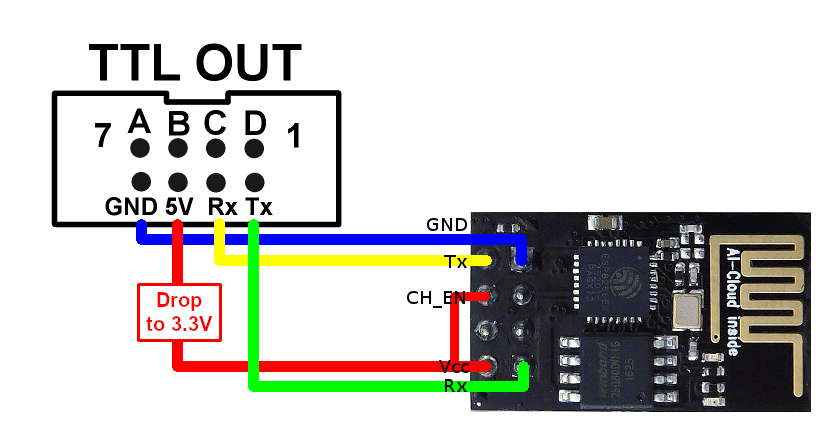
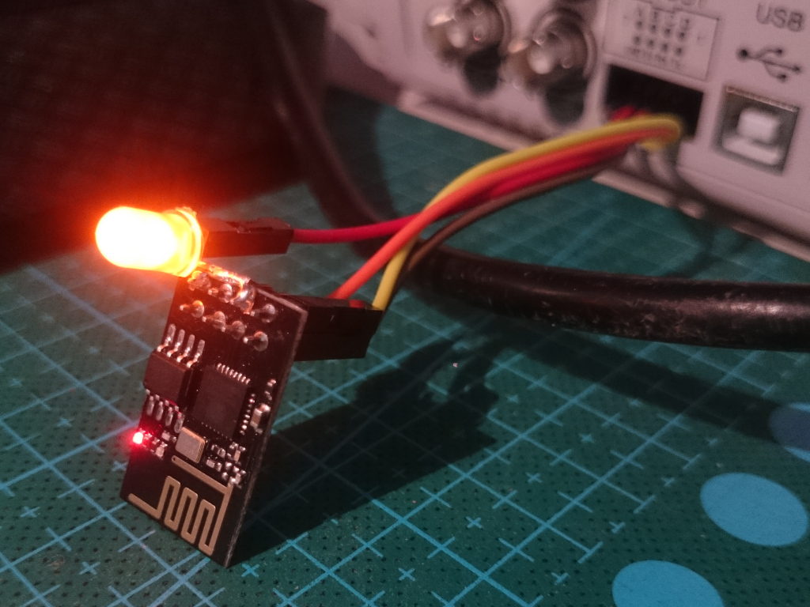

# espBode
Interface between a Siglent oscilloscope and FY6800, FY6900 or JDS2800 AWG

The idea bases on solution proposed by 4x1md in https://github.com/4x1md/sds1004x_bode

**Currently implemented features:**
 - ESP is able to connect to a selected WiFi network and listen to oscilloscope requests
 - After ESP sends request to AWG it waits for confirmation

**Currently supported AWG's:**
 - FY6800
 - FY6900
 - JDS2800

**Required Arduino boards and libraries:**
 - board "Generic ESP8266 Module" from package "esp8266 by ESP8266 Community" from GitHub https://github.com/esp8266/Arduino -> add https://arduino.esp8266.com/stable/package_esp8266com_index.json to Preferences 'Additional Boards Manager Urls'
 - library "ESP Telnet"
 - library "ESP8266WiFi" (comes with board "Generic ESP8266 Module")
 - library "ESP8266WebServer" (comes with board "Generic ESP8266 Module")

**Known issues:**
 - some users report UART connection problems via the FY6900 AWG TTL
   see: [eevblog Bode plot with a non-Siglent AWG msg3580066](https://www.eevblog.com/forum/testgear/siglent-sds1104x-e-and-sds1204x-e-bode-plot-with-non-siglent-awg/msg3580066/#msg3580066)
 - there seems to be an issue with  blocking TCP/IP communicationin conjuntion with newer Arduino ESP8266 board libraries (3.x)
   it seems that downgrading the board library to 2.7.4 can fix this
   see: [eevblog Bode plot with a non-Siglent AWG msg3933608](https://www.eevblog.com/forum/testgear/siglent-sds1104x-e-and-sds1204x-e-bode-plot-with-non-siglent-awg/msg3933608/#msg3933608)
   see: [eevblog Bode plot with a non-Siglent AWG msg4132834](https://www.eevblog.com/forum/testgear/siglent-sds1104x-e-and-sds1204x-e-bode-plot-with-non-siglent-awg/msg4132834/?PHPSESSID=p0v329ju951nur8mkqmoq9ps18#msg4132834)

**TODO:**
 - rewrite whole thing to C++, so adding new AWGs would be easier
 - add possibility to configure SSID/PSK + IP without flashing the new SW

**Getting started:**
 - You can view a video with the SDS-1204X-E and the FY6900 here https://www.youtube.com/watch?v=3_4DelT9P2A
 - **!WARNING! FY6900 VCC level is 5V, so it has to be dropped somehow to 3.3V ESP may release the magic smoke otherwise.**
 - One option is to used a yellow LED in the 5V line to drop the voltage by ~2V.
 - But remark, that ESP consumes about 70mA, that's probably too much for a LED, so no long time solution.

 

 
